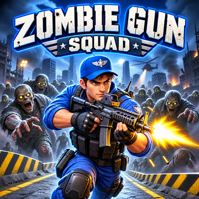
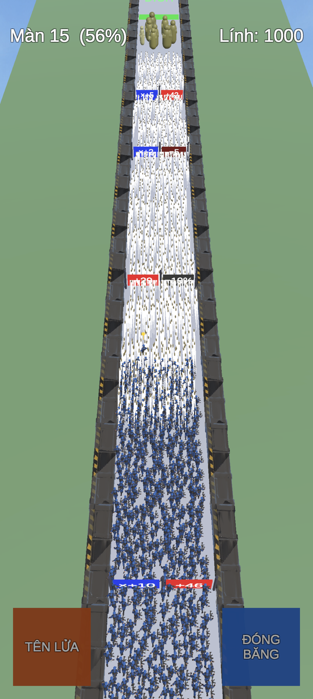
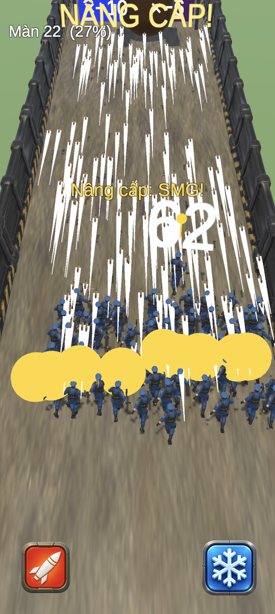
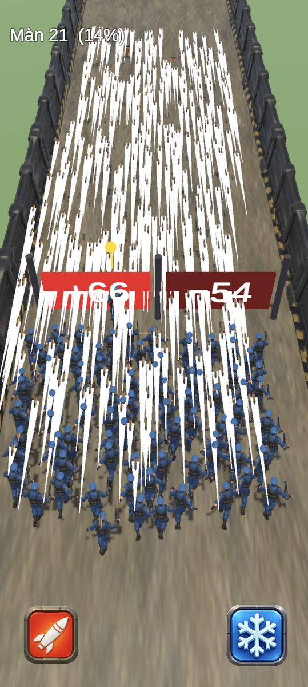
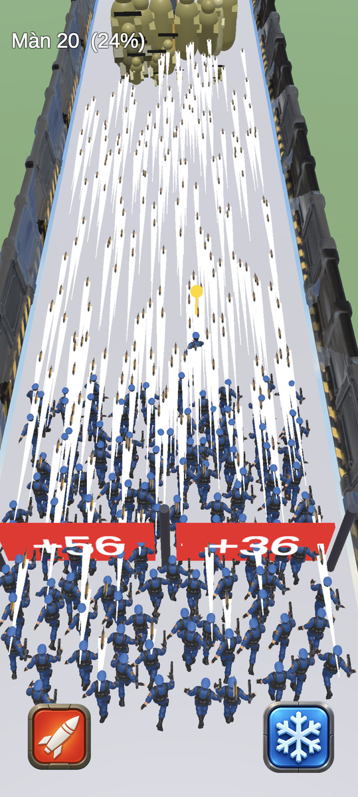

<div align="center">



# Zombie Gun Squad

**A crowd-runner zombie shooter built with Unity 6 — grow an army of up to 1,500 soldiers, pick your gates wisely, and survive 100 increasingly brutal levels.**


</div>

---

## 📱 Screenshots

| Bullet Storm | Weapon Upgrade | Math Gates | Squad March |
|:---:|:---:|:---:|:---:|
|  |  |  |  |

---

## 🎮 Gameplay

Start every level with **a single soldier**. Steer your squad through math gates that multiply — or decimate — your army, blast through endless zombie hordes, and reach the finish line.

- **5 gate types**: `+N` / `−N` / `×+M` / `×−M` (divide) / `−X%` — probabilities and value ranges shift level by level, from a forgiving Level 1 to a 96%-hostile Level 100
- **6 weapon tiers**: Pistol → SMG → Rifle → Dual SMG → Minigun → **ROBOT MODE** — earned by shooting upgrade crates on the road
- **4 zombie types**: shambling walkers, sprinting runners, hulking tanks, and giant horned **bosses** (1 + level/8 per level)
- **Endless pressure**: zombies continuously stream from the finish line and hunt you down — standing still is death
- **2 active skills**: Rocket strike (AoE) and Freeze (stops the horde for 4s), with cooldown UI
- **Squad up to 1,500**: 500 rendered soldiers, the rest represented by amplified firepower (up to ×3 bullet damage)

## 🏗️ Technical Highlights

| System | Approach |
|---|---|
| **Level generation** | 100 levels generated procedurally at runtime from a per-attempt seed — retry always rolls a fresh layout. Zero per-level assets. |
| **Combat** | No physics engine involved: bullets, gates, melee and crates all use hand-rolled distance checks against static registries, with axis pruning for 800+ live bullets |
| **Crowd performance** | Object pooling with pre-warm during the "tap to start" screen, staggered spawning (25/frame), weapon-only rebuilds on upgrade (8/frame), animator culling, virtual-soldier firepower scaling |
| **Character pipeline** | Humanoid retargeting: one run clip drives the soldier model; each zombie ships walk + death clips wired into auto-generated AnimatorControllers |
| **Environment** | Editable in-editor via a custom `ZombieRoad` menu — designers hand-edit the scene (`edited.unity`) and the runtime detects and respects it, only spawning gameplay on top |
| **Build automation** | One-command batch builds (`BuildScript.cs`): APK for device testing, signed AAB for Google Play, with debug symbols, keystore signing, AdMob configuration and asset preprocessing all scripted |
| **Monetization** | Google Mobile Ads v11: top banner, app-open ad, rewarded ads gating level progression — background-preloaded with automatic retry, and a graceful offline gate |

## 🤖 AI-Assisted Asset Pipeline

All 3D art started as text prompts:

```
Codex (image generation, chroma-key ready)
        │  32 curated prompts — characters in strict T-pose, props, textures, UI icons
        ▼
Meshy.ai (image → 3D model + auto-rig + animation library)
        │  soldiers, 4 zombies, robot, weapons, environment props
        ▼
Blender CLI (headless decimation 100k→3k tris, texture extraction, GLB→FBX)
        ▼
Unity (Humanoid import, material generation with metallic cleanup, runtime normalization)
```

The importer code self-heals against common AI-model quirks: baked axis conversions, upside-down orientations, dirty metallic maps and duplicate non-humanoid clips.

## 🛠️ Building

**Requirements**: Unity 6000.0.60f1 with Android Build Support (SDK/NDK/OpenJDK).

```bash
# APK (testing)
Unity.exe -batchmode -quit -projectPath <project> -buildTarget Android ^
  -executeMethod ZombieRoad.BuildScript.PerformAndroidBuild

# Signed AAB (Google Play)
Unity.exe -batchmode -quit -projectPath <project> -buildTarget Android ^
  -executeMethod ZombieRoad.BuildScript.PerformPlayBuild
```

> **Note**: builds require a `zombiegun.keystore` in the project root (not committed) and the Google Mobile Ads Unity plugin (import `GoogleMobileAds.unitypackage`, then run `ZombieRoad.BuildScript.SetupAds`).

## 📂 Project Structure

```
Assets/ZombieRoad/
├── Scripts/           # Toàn bộ gameplay (12 runtime scripts, không phụ thuộc asset ngoài)
│   ├── GameManager.cs     # Vòng đời màn chơi, spawn quái, dòng quái vô tận
│   ├── GameConfig.cs      # Cân bằng 100 màn: tỉ lệ cổng, máu quái, vũ khí
│   ├── PlayerSquad.cs     # Đội hình, pool, quân ảo, nâng cấp rải frame
│   ├── Soldier.cs / Zombie.cs / Gate.cs / Crate.cs / Bullet.cs
│   ├── SkillManager.cs    # Rocket + Freeze
│   ├── AdsManager.cs      # AdMob với load nền + retry
│   └── ModelLib.cs        # Chuẩn hóa model AI (trục, scale, material)
├── Editor/
│   ├── BuildScript.cs         # Pipeline build APK/AAB tự động
│   └── EnvironmentBuilder.cs  # Menu dựng/sửa môi trường trong editor
└── Resources/         # Model, material, animator controller, UI
```

## 👤 Credits

- **Design & direction**: [quanh1xycpn](https://github.com/quanh1xycpn)
- **Code**: written with Claude Code (Anthropic)
- **3D assets**: generated with Codex + [Meshy.ai](https://meshy.ai) (image-to-3D, rigging, animation)
- **Ads**: Google AdMob

---

<div align="center">
<i>From a single reference screenshot to a signed Play Store build — built end-to-end with an AI-assisted workflow.</i>
</div>
